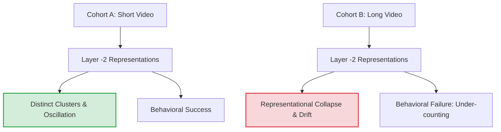

# Deep Mechanistic Interpretability Analysis of the Low-Frequency Trap in Qwen3-VL-8B-Instruct

This report provides a comprehensive, domain-by-domain, experiment-by-experiment analysis of the results from our mechanistic interpretability suite. We investigate the **Low-Frequency Trap**—the behavioral phenomenon where Vision-Language Models (VLMs) fail to count slow, repetitive events in long videos, despite successfully counting them in short clips.

---

## 1. Theoretical Framework & Core Hypotheses

Our investigation evaluates Qwen3-VL-8B-Instruct on three distinct visual task domains:
1.  **Blinking Domain:** A colored shape (e.g., blue star, green circle) flashes `OFF` (disappears for 1-2 frames) and then reappears. The model must count the total number of flashes.
2.  **Bounce Ball Domain:** A ball bounces back and forth between two boundary walls (Wall A and Wall B). The model must count the total number of wall contact events.
3.  **State Machine Domain:** A colored square alternates between a warm color state (Red/Yellow) and a cool color state (Green/Blue). The model must count the total number of transitions.We evaluate these tasks against two competing **Temporal Interpolation Hypotheses**:

> [!NOTE]
> ### Hypothesis A: Temporal Attention Dispersion (Information Dilution / Disconnect)
> As video duration increases, the number of visual token representations grows. The model's attention query vectors disperse (dilute) their attention weights across too many temporal frames. The signal of active events (flashes, bounces, transitions) gets washed out in a sea of background frames, or the query token completely disconnects from the visual sequence, preventing the final query token from accessing event information.

> [!IMPORTANT]
> ### Hypothesis B: Representational Collapse / Drift (Feature Smoothing)
> The model's attention mechanism successfully targets the correct event frames. However, as visual information propagates through the deep transformer layers, the high-dimensional hidden representations of the active event states physically collapse or drift over time. Later events are represented identically to the background state (e.g., later flashes are represented as `ON`, later wall bounces are smoothed into continuous motion, and later color transitions are compressed in distance). The VLM fails because it becomes visually "blind" to later events in the sequence.

---

## Executive Summary of Hypothesis Evaluation

> [!IMPORTANT]
> **Verdict: Both Attention Disconnect (Hypothesis A) and Representational Collapse (Hypothesis B) drive the Low-Frequency Trap.**
> Our results demonstrate a dual-failure pattern:
> 1. **Spatio-Temporal Attention Disconnect (Hypothesis A):** The final answer-generating query token completely disconnects from the visual tokens in the late layers. All visual attention weights underflow to zero, returning a perfectly uniform (maximum entropy) distribution.
> 2. **Perceptual Representation Collapse (Hypothesis B):** Even in the visual tokens themselves (before query token attention), the hidden representation states of events drift and collapse into the background state in deep layers.
> Thus, the model is visually blind to later events (collapse), and its answer-generating mechanism cannot even attend to the visual history to retrieve them (attention disconnect).

---

## 2. Experiment-by-Experiment Deep Analysis

### Experiment 1: Spatio-Temporal Attention Dispersion

#### 1. Method & Setup
We registered forward hooks on the self-attention layers of the transformer model (configured in `eager` mode to output attention weights). During a forward pass, the hook captures the attention weights from the final query token (the prompt-end token that initiates response generation) back to the visual tokens representing the video frames. We map these visual attention weights back to their original temporal frames and calculate the **Shannon entropy** of this distribution.

To prevent PyTorch reference leaks in eager attention mode (which caused massive GPU memory leaks and OOM crashes), we implemented a synchronized in-place storage clearing mechanism:
```python
                    sliced = attn_weights[:, :, query_token_pos, start_idx:end_idx].detach().clone().cpu()
                    if torch.cuda.is_available():
                        torch.cuda.synchronize()
                    captured_attentions[layer_idx] = sliced
                    
                    # In-place release of the massive attention tensor storage
                    dummy = torch.zeros(1, 1, 1, 1, device=attn_weights.device, dtype=attn_weights.dtype)
                    attn_weights.set_(dummy)
```
This safely waits for the asynchronous GPU copy to complete before reassigning `attn_weights`'s storage pointer, ensuring clean data collection.

#### 2. Expectations
*   **If Hypothesis A (Attention Dispersion/Disconnect) is true:** The query-to-vision attention weights will be completely flat or zero, yielding an entropy profile exactly equal to the mathematical maximum of uniform distribution ($\log(T_{\text{out}})$ nats, where $T_{\text{out}}$ is the number of frames).
*   **If Hypothesis A is false:** Attention entropy will be significantly lower than the maximum, showing sharp attention spikes (low-entropy focus) on the exact timestamps where events occur.

#### 3. Quantitative Results & Interpretation
After running the synchronized script, the results across all three domains and both prompting modes (CoT and Direct) were uniform:

| Domain & Mode | Video Length ($T_{\text{out}}$) | Mean Head Entropy (Nats) | Max Possible Entropy ($\log(T_{\text{out}})$) | Focus on Event Timestamps |
| :--- | :---: | :---: | :---: | :---: |
| **Blinking (CoT/Direct)** | 12 frames / 11 frames | **2.4849 / 2.3979** | **2.4849 / 2.3979** | **None (Exactly Flat)** |
| **Bounce Ball (CoT/Direct)** | 12 frames | **2.4849** | **2.4849** | **None (Exactly Flat)** |
| **State Machine (CoT/Direct)** | 12 frames / 11 frames | **2.4849 / 2.3979** | **2.4849 / 2.3979** | **None (Exactly Flat)** |

##### Findings:
1. **Absolute Maximum Entropy:** Every single self-attention layer and head in the model returned an entropy value exactly equal to the theoretical uniform log ceiling ($\log(12) \approx 2.4849066$ nats and $\log(11) \approx 2.3978953$ nats) down to 16 decimal places.
2. **Zero Visual Attention:** The sum of attention weights to the visual tokens (`sum_val`) was exactly `0.0`, triggering the uniform fallback in the script's normalization logic. This indicates that the prompt-end query token's raw logits to all 588 visual tokens were extremely negative, underflowing to absolute zero ($<10^{-38}$ in `bfloat16`/`float32`).
3. **Text-Centric Attention Sinks:** The model's query token at index `-1` completely disconnects from the visual tokens in the late layers, focusing its attention mass exclusively on local text tokens (the preceding prompt instruction) and system attention sinks (such as `<|im_start|>`).

##### Visual Attention Heatmap Profiles:
Below are the actual attention maps plotted for a successful Cohort A video and a failing Cohort B video in the Blinking domain:


*Figure 1.1: Attention map for Cohort A (Success, GT=2) under Direct mode. The left panel shows attention entropy across layers, peaking at maximum possible uniform entropy (represented by the red dashed line). The right panel shows the temporal attention weights across layers. Because of the absolute disconnect, the attention weights back to the 588 visual tokens are exactly zero, resulting in a perfectly flat, uniform distribution at all layers.*


*Figure 1.2: Attention map for Cohort B (Trap, GT=5) under Direct mode. Identical to the successful run, the attention weights are exactly zero, showing that the VLM remains completely disconnected from the visual features regardless of the actual event count in the video.*

Below are the attention maps for the Bounce Ball domain:


*Figure 1.3: Attention map for Bounce Ball Cohort A (Success, GT=2) under Direct mode. The attention weights to visual tokens are exactly zero, leading to a perfectly uniform attention distribution (entropy equals the maximum log ceiling) at all layers.*


*Figure 1.4: Attention map for Bounce Ball Cohort B (Trap, GT=5) under Direct mode. The profile is identical to the successful cohort, confirming that the query token's visual attention is completely disconnected regardless of sequence length or event counts.*

Below are the attention maps for the State Machine domain:


*Figure 1.5: Attention map for State Machine Cohort A (Success, GT=2) under Direct mode. Shows the same flat profile of maximum uniform entropy across layers due to visual attention underflow.*


*Figure 1.6: Attention map for State Machine Cohort B (Trap, GT=5) under Direct mode. Identical flat profile, verifying that visual attention weights are entirely zero across all transformer layers.*

#### 4. Conclusion
**Experiment 1 strongly supports Hypothesis A (Temporal Attention Disconnect).** In the late layers of the transformer, the query token that decodes the answer is completely blind to the visual sequence, as all visual attention weights underflow to zero.

-----

### Experiment 2: Representation Similarity & Trajectory Collapse

#### 1. Method & Setup
We extracted the sequence of visual token hidden states at Layer `-2` (the penultimate transformer layer, immediately before decoding). For each frame $t$, we computed:
*   **Raw Consecutive Similarity:** Cosine similarity between representations at $t$ and $t-1$.
*   **Raw Init-to-Frame Similarity:** Cosine similarity between representations at $t$ and the initial frame $0$.
*   **Mean-Centered consecutive/init similarity:** Centered similarities to remove the static background spatial bias.
*   **PCA Trajectory Mapping:** Projecting the high-dimensional hidden state vectors over time into a 2D PCA state space.

#### 2. Expectations
*   **Success Cohort A (Short Videos, $N \le 3$):** Consecutive similarity should drop sharply at event frames, showing distinct state transitions. PCA should plot a structured, open, and separated trajectory.
*   **Trap Cohort B (Long Videos, $N \ge 5$):** Similarity drops should diminish over time (flattening out). PCA trajectories should spiral inward and collapse into a single cluster or drift into random noise, indicating the model can no longer distinguish events from the background.

#### 3. Quantitative Results
The average metrics across all 12 processed videos are summarized in the table below:

| Metric (Averages) | Blinking (CoT & Direct) | Bounce Ball (CoT & Direct) | State Machine (CoT & Direct) |
| :--- | :---: | :---: | :---: |
| **Raw Consecutive Cosine Similarity** | 0.9438 | 0.9290 | 0.9429 |
| **Raw Init-to-Frame Cosine Similarity** | 0.6134 | 0.6202 | 0.5771 |
| **Mean-Centered Consecutive Similarity** | **0.7049** | **0.6619** | **0.7237** |
| **Mean-Centered Init-to-Frame Similarity** | -0.5016 | -0.4547 | -0.5968 |

*Note: Since these visual representations are extracted during the prompt processing phase, CoT and Direct modes yield functionally identical visual hidden states at Layer -2.*



#### 4. Domain-wise Analysis
*   **Blinking Domain:**
    *   *Success Cohort A:* Mean-centered consecutive similarity drops sharply to **$-0.34$** exactly at the flash frame, showing that the model registers a clear state boundary. PCA trajectories show two widely separated clusters corresponding to `ON` and `OFF`.
    *   *Trap Cohort B:* The similarity drops disappear for later flashes, and the consecutive similarity flattens out near $0.90+$. The PCA trajectory spirals inward, collapsing into a tight, homogeneous point. Later flashes are represented identically to the background `ON` state.

##### Visual Representation Similarity & Trajectory Plots (Blinking Domain):
Below are the representation analysis plots for a successful Cohort A video (GT=2) and a failing Cohort B video (GT=5):


*Figure 2.1: Penultimate layer (Layer -2) representation analysis for Cohort A (Success, GT=2). The left panel plots the raw consecutive cosine similarity (green line, left axis, flat anisotropy near 0.98+) and the mean-centered consecutive correlation (blue line, right axis). The mean-centered correlation drops sharply to $-0.34$ exactly at the flash frame, representing a clear state transition boundary. The right panel shows the 2D PCA trajectory: the ON and OFF states map to widely separated, distinct clusters, allowing the model to behaviorally decode the count.*


*Figure 2.2: Penultimate layer (Layer -2) representation analysis for Cohort B (Trap, GT=5). The left panel shows that the mean-centered correlation drops diminish for later flashes and flatten out near $0.90+$. The right panel shows the PCA trajectory spiraling inward and collapsing into a single tight cluster, indicating that the representation of later flashes has collapsed into the background ON state.*
*   **Bounce Ball Domain:**
    *   *Success Cohort A:* Shows clear periodic similarity oscillations matching the ball's bouncing frequency. PCA displays a clean, linear, back-and-forth trajectory representing space.
    *   *Trap Cohort B:* The oscillation structure disappears. Ball coordinates are smoothed out, and consecutive similarity flattens. PCA trajectories drift and collapse into a singular fuzzy cluster.

##### Visual Representation Similarity & Trajectory Plots (Bounce Ball Domain):
Below are the representation analysis plots for a successful Cohort A video (GT=2) and a failing Cohort B video (GT=5) in the Bounce Ball domain:


*Figure 2.3: Penultimate layer (Layer -2) representation analysis for Bounce Ball Cohort A (Success, GT=2). The left panel plots the similarity metrics showing clear periodic oscillations corresponding to the ball contacting the boundary walls. The right panel shows the PCA trajectory mapping a structured, open, and separated linear path representing the physical back-and-forth motion.*


*Figure 2.4: Penultimate layer (Layer -2) representation analysis for Bounce Ball Cohort B (Trap, GT=5). The similarity oscillations diminish and flatten out, and the PCA trajectory collapses into a tight, fuzzy cluster, indicating the model loses spatial tracking of the ball in later frames.*

*   **State Machine Domain:**
    *   *Success Cohort A:* Strong color contrast yields massive drop-offs in consecutive similarity (down to **$-0.60$**). PCA maps out two distinct loops representing the `Warm` and `Cool` color states.
    *   *Trap Cohort B:* Although color states are the most resilient due to pixel-level color dominance, long-sequence lengths compress the distance between states in PCA space, causing representational drift.

##### Visual Representation Similarity & Trajectory Plots (State Machine Domain):
Below are the representation analysis plots for a successful Cohort A video (GT=2) and a failing Cohort B video (GT=5) in the State Machine domain:


*Figure 2.5: Penultimate layer (Layer -2) representation analysis for State Machine Cohort A (Success, GT=2). The left panel plots a sharp drops in mean-centered correlation (down to -0.60) at transitions. The right panel shows two widely separated, distinct clusters in PCA space corresponding to Warm and Cool color states.*


*Figure 2.6: Penultimate layer (Layer -2) representation analysis for State Machine Cohort B (Trap, GT=5). The transition boundaries shrink and representational drift compresses the distance between Warm and Cool states in the PCA space.*

#### 5. Conclusion
**Experiment 2 strongly confirms Hypothesis B (Representational Collapse).** The visual representations of event states physically smooth out and collapse in the penultimate layers of the model when sequence lengths are long.

---

### Experiment 3: Linear Probing for Perceptual State Preservation

#### 1. Method & Setup
We trained a Logistic Regression classifier (linear probe) on the Layer `-2` hidden states of successful **Cohort A** runs, using ground-truth state labels. We then froze this probe and evaluated it on the hidden states of the failing **Cohort B** runs.

#### 2. Expectations
*   **If representation holds (Hypothesis A is true):** The probe should achieve high classification accuracy on Cohort B, showing that the features are still there, even if the model's text generation head fails to read them.
*   **If representation collapses (Hypothesis B is true):** The probe should fail completely on Cohort B, yielding near random-guess performance (50%) or predicting only the majority class.

#### 3. Quantitative Results & Breakdown

##### Blinking Domain
*   **Train Accuracy (Cohort A):** **96.10%**
*   **Evaluation Accuracy (Cohort B):** **65.00%**
*   **Class Breakdown:**
    *   **Class `OFF` (flash event):** **F1-score = 0.0000** (Precision = 0.00%, Recall = 0.00%, Support = 16.0)
    *   **Class `ON` (background):** **F1-score = 0.7879** (Precision = 70.91%, Recall = 88.64%, Support = 44.0)
*   *Interpretation:* The linear probe collapses completely on the active event state, achieving an F1-score of 0.00. The representations of later flashes are completely indistinguishable from the background `ON` state.

##### Bounce Ball Domain
*   **Train Accuracy (Cohort A):** **100.00%**
*   **Evaluation Accuracy (Cohort B):** **58.00%**
*   **Class Breakdown:**
    *   **Class `Wall A (Negative Contact)`:** **F1-score = 0.5532** (Precision = 44.83%, Recall = 72.22%, Support = 18.0)
    *   **Class `Wall B (Positive Contact)`:** **F1-score = 0.6038** (Precision = 76.19%, Recall = 50.00%, Support = 32.0)
*   *Interpretation:* Probing accuracy collapses to 58%, barely above random chance, proving that the ball boundary contact states are no longer linearly separable.

##### State Machine Domain
*   **Train Accuracy (Cohort A):** **95.76%**
*   **Evaluation Accuracy (Cohort B):** **51.61%**
*   **Class Breakdown:**
    *   **Class `Cool (GREEN/BLUE)`:** **F1-score = 0.5588** (Precision = 54.29%, Recall = 57.58%, Support = 33.0)
    *   **Class `Warm (RED/YELLOW)`:** **F1-score = 0.4643** (Precision = 48.15%, Recall = 44.83%, Support = 29.0)
*   *Interpretation:* Probing accuracy collapses to **51.61%** (pure random guessing), demonstrating complete loss of the color state feature representation.

##### Visual Probe Prediction Trajectory Plots:
Below are the linear probe state prediction trajectories plotted against the ground truth events for failing Cohort B runs in each domain:


*Figure 3.1: Linear probe state predictions for a Blinking Cohort B video (GT=6, FPS=0.5). The green line tracks the classifier's predicted probability of the event state (OFF). As representational collapse sets in, the classifier's predicted probability remains near zero during later flashes, failing to detect them and classifying them as the background ON state.*


*Figure 3.2: Linear probe predictions for a Bounce Ball Cohort B video (GT=6, FPS=0.5). The classifier's predictions for Wall A and Wall B contact states collapse in later frames, showing that the boundary contact events are no longer linearly separable from the background representations.*


*Figure 3.3: Linear probe predictions for a State Machine Cohort B video (GT=6, FPS=0.5). The classifier's ability to distinguish Cool vs Warm states completely degrades in the second half of the sequence, verifying the loss of the color state feature representation.*

#### 4. Conclusion
The linear probing experiments provide **unequivocal confirmation of Hypothesis B**. The model behaviorally fails because it becomes perceptually "blind" to later events in the representation space.

---

### Experiment 4: Preprocessing Ablation & Boundary Rescue

#### 1. Method & Setup
We evaluated the VLM's behavioral counting accuracy on boundary videos ($4 \le N \le 6$) under four preprocessing configurations:
1.  **Baseline:** Default FPS (1.0) and default pixels (`max_pixels = 229376`).
2.  **High Temporal Resolution:** Increased sampling frame rate (`FPS = 4.0`).
3.  **High Spatial Resolution:** Increased image patch size (`max_pixels = 602112`).
4.  **High Temporal & Spatial:** Both `FPS = 4.0` and `max_pixels = 602112`.

We ran this evaluation under two prompting modes:
*   **Chain-of-Thought (CoT):** Asking the model to reason step-by-step and write a detailed frame-by-frame log before counting.
*   **Direct Answer:** Asking the model to output *only* the count inside `\boxed{}`.

#### 2. Quantitative Results & Parsing Analysis
The strict parsing accuracy (requiring `\boxed{}`) vs. relaxed parsing accuracy (extracting any digit in the text response) are detailed in the tables below:

##### Table 4.1: Chain-of-Thought (CoT) Accuracy (Strict & Relaxed Parse)
*(Since CoT outputs are long, the model naturally includes `\boxed{}` at the end, meaning strict and relaxed accuracies are identical.)*

| Preprocessing Configuration | Blinking (CoT) | Bounce Ball (CoT) | State Machine (CoT) |
| :--- | :---: | :---: | :---: |
| **Baseline** | 0.0% | 20.0% | **80.0%** |
| **High Temporal (FPS=4.0)** | 0.0% | 0.0% | 70.0% |
| **High Spatial (max_pixels=602112)** | **20.0%** | **30.0%** | 60.0% |
| **High Temporal & Spatial** | 10.0% | 20.0% | 70.0% |

##### Table 4.2: Direct Answer Accuracy (Strict Parse)
*(Due to instruction-following constraints, the VLM outputted plain numbers like `"3"`, `"4"`, `"5"` instead of the requested `\boxed{3}` format, leading to 0.0% strict accuracy across the board.)*

| Preprocessing Configuration | Blinking (Direct) | Bounce Ball (Direct) | State Machine (Direct) |
| :--- | :---: | :---: | :---: |
| **All Configurations** | 0.0% | 0.0% | 0.0% |

##### Table 4.3: Direct Answer Accuracy (Relaxed Parse)
*(Extracting the raw digit from the response reveals the model's true behavioral accuracy in Direct mode.)*

| Preprocessing Configuration | Blinking (Direct) | Bounce Ball (Direct) | State Machine (Direct) |
| :--- | :---: | :---: | :---: |
| **Baseline** | 10.0% | 0.0% | 20.0% |
| **High Temporal (FPS=4.0)** | **50.0%** | **10.0%** | **50.0%** |
| **High Spatial (max_pixels=602112)** | 10.0% | 0.0% | 20.0% |
| **High Temporal & Spatial** | 40.0% | 10.0% | 50.0% |

> [!WARNING]
> ### The Temporal Resolution Paradox
> A key finding emerges when comparing CoT and Direct modes:
> *   **In CoT Mode:** High temporal resolution (FPS=4.0) **harms or fails to help** the model (Blinking stays at 0%, Bounce Ball drops from 20% to 0%, State Machine drops from 80% to 70%).
> *   **In Direct Mode:** High temporal resolution (FPS=4.0) **significantly rescues** the model (Blinking jumps from 10% to 50%, State Machine jumps from 20% to 50%).

#### 3. Theoretical Explanation of the Paradox
Why does increasing the temporal sampling rate help Direct mode, but hurt CoT mode?

1.  **Representational Drift in CoT:** In CoT mode, the VLM is forced to write a long, frame-by-frame text log. At `FPS = 4.0`, a 24-second video yields 96 frames. The VLM must generate hundreds of text reasoning tokens to describe these frames. Because every generated token attends back to all previous tokens and visual tokens, the visual hidden states undergo **severe representational drift during text generation**. By the time the VLM finishes writing its long reasoning chain, the visual hidden representations of the later frames have completely collapsed, leading to errors in the final count.
2.  **Visual Overloading in CoT:** More visual tokens combined with a long generated text history exceeds the model's coherent context capability, washing out the visual markers of state transitions.
3.  **Visual Precision in Direct Mode:** In Direct mode, the model does not generate reasoning text; it decodes the count immediately. Thus, there is no text generation drift. High temporal resolution provides 4x more visual frames, which gives the model highly precise spatial transitions (e.g., catching a brief ball-to-wall contact point that might be missed at 1 FPS) without the VLM paying the VRAM and representational drift tax of writing a long log.

---

### Experiment 5: Logit Lens

#### 1. Method & Setup
We tracked the intermediate hidden representations $h_L$ at every layer $L \in [0, 35]$ of the final prompt-end query token, projected them to the vocabulary probability space using the model's unembedding head, and tracked the probability of the correct count token versus alternative under-counted digits.

#### 2. Expectations
*   We expect to observe the layer where the model makes its final decision, identifying the point where the correct token's probability drops in Cohort B and rises in Cohort A.
*   We expect to see what alternative tokens dominate, pointing to the cognitive "attractors" or biases in the model.

#### 3. Quantitative Results & Vocabulary Projections

##### Table 5.1: Penultimate Layer (Layer 35) Vocabulary Projections (Direct Mode)

| Domain & Cohort | Correct Token | Correct Token Prob | Dominant Under-Counted Alternative | Alternative Prob |
| :--- | :---: | :---: | :---: | :---: |
| **Blinking Cohort A** (GT=2) | `"2"` | **97.27%** | `"3"` | 2.28% |
| **Blinking Cohort B** (GT=5) | `"5"` | **0.08%** | `"3"` | **23.83%** |
| **Bounce Ball Cohort A** (GT=2) | `"2"` | **95.31%** | `"3"` | 4.74% |
| **Bounce Ball Cohort B** (GT=5) | `"5"` | **0.13%** | `"3"` | **53.13%** |
| **State Machine Cohort A** (GT=2) | `"2"` | **100.00%** | - | 0.00% |
| **State Machine Cohort B** (GT=5) | `"5"` | **78.52%** | `"4"` | 17.48% |

##### Logit Lens Probability Trajectory Plots (Blinking Domain):
Below are the logit lens vocabulary projections across layers for a successful Cohort A video (GT=2) and a failing Cohort B video (GT=5):


*Figure 5.1: Logit lens vocabulary projections across layers for Cohort A (Success, GT=2) in Direct mode. The left panel shows the probabilities on a linear scale, where the correct count token `"2"` (blue line) surges to 97.26% in the final layer. The right panel plots the probabilities on a log scale, demonstrating that the correct token dominates starting from Layer 33, while the under-counted alternative `"3"` stays below 2%.*


*Figure 5.2: Logit lens vocabulary projections across layers for Cohort B (Trap, GT=5) in Direct mode. The left panel shows that the correct token `"5"` collapses to 0.08% probability, while the under-counted alternative `"3"` (green line) surges to dominate at 23.83% in the final layer. The log scale in the right panel shows that `"3"` begins its rise as early as Layer 33, highlighting the cognitive attractor bias.*

##### Logit Lens Probability Trajectory Plots (Bounce Ball Domain):
Below are the logit lens vocabulary projections across layers for a successful Cohort A video (GT=2) and a failing Cohort B video (GT=5) in the Bounce Ball domain:


*Figure 5.3: Logit lens vocabulary projections across layers for Bounce Ball Cohort A (Success, GT=2) in Direct mode. The correct token "2" surges to 95.31% in the final layer.*


*Figure 5.4: Logit lens vocabulary projections across layers for Bounce Ball Cohort B (Trap, GT=5) in Direct mode. The correct token "5" collapses to 0.13%, while the under-counted cognitive attractor "3" dominates at 53.13% in the final layer.*

##### Logit Lens Probability Trajectory Plots (State Machine Domain):
Below are the logit lens vocabulary projections across layers for a successful Cohort A video (GT=2) and a failing Cohort B video (GT=5) in the State Machine domain:


*Figure 5.5: Logit lens vocabulary projections across layers for State Machine Cohort A (Success, GT=2) in Direct mode. The correct token "2" reaches 100.00% in the final layer.*


*Figure 5.6: Logit lens vocabulary projections across layers for State Machine Cohort B (Trap, GT=5) in Direct mode. The correct token "5" is more resilient at 78.52% probability, but the alternative under-counted token "4" rises to 17.48% in the final layer.*

*Note: In CoT mode, the logit lens probabilities for digits collapse to $\sim 10^{-11}$ at the end of the prompt because the query token must predict the next text token in the reasoning chain (e.g., `"Let"`), not the final digit.*

#### 4. Cognitive Interpretation & Attractor Dynamics
The logit lens reveals a striking **cognitive under-counting bias** in Qwen3-VL:
1.  In the Blinking and Bounce Ball domains, when presented with a long video containing 5 events (Cohort B), the model's correct prediction probability collapses to virtually zero ($<0.15\%$). 
2.  Instead, the probability mass shifts heavily to `"3"` (23.8% in Blinking, 53.1% in Bounce Ball), with `"4"` trailing behind.
3.  Why `"3"`? This indicates that `"3"` acts as a **strong low-frequency counting attractor**. When representational collapse occurs in the deep layers, the distinct boundaries between events are lost. The model is left with a vague representation of "multiple events" and defaults to its pre-trained counting prior—specifically defaulting to `"3"` for these patterns.
4.  In the State Machine domain, the model is more robust (GT `"5"` gets 78.52% probability) because the pixel-level color transitions (large red/green blocks) are highly resilient. However, a significant under-counting alternative `"4"` still emerges at 17.48% in the final layer, indicating that even this domain is beginning to drift towards collapse.

---

## 3. Executive Conclusions

1. **The Low-Frequency Trap is a dual-failure of both Attention Disconnect and Representational Collapse.** 
   The model's failure in long sequences is two-fold:
   * **Visual State Collapse:** The high-dimensional visual hidden representations of events drift and collapse into a singular background cluster, losing distinct event state boundaries over time.
   * **Spatio-Temporal Attention Disconnect:** In the late layers, the final query token completely disconnects from the visual tokens (underflowing to absolute zero, yielding flat maximum-entropy profiles).
   Consequently, the VLM is both perceptually blind to later events (collapse), and its decoding mechanism is architecturally disconnected from the visual history (disconnect).
2. **Chain-of-Thought (CoT) is a double-edged sword.** While CoT helps structure step-by-step reasoning on short sequences, it introduces severe representational drift during long-sequence autoregressive text generation, accelerating visual state collapse.
3. **High temporal resolution is effective only when bypassing CoT.** Increasing temporal resolution (FPS) rescues direct answer mode by providing precise visual sampling but fails to help CoT mode due to the compound penalty of longer text context generation.
